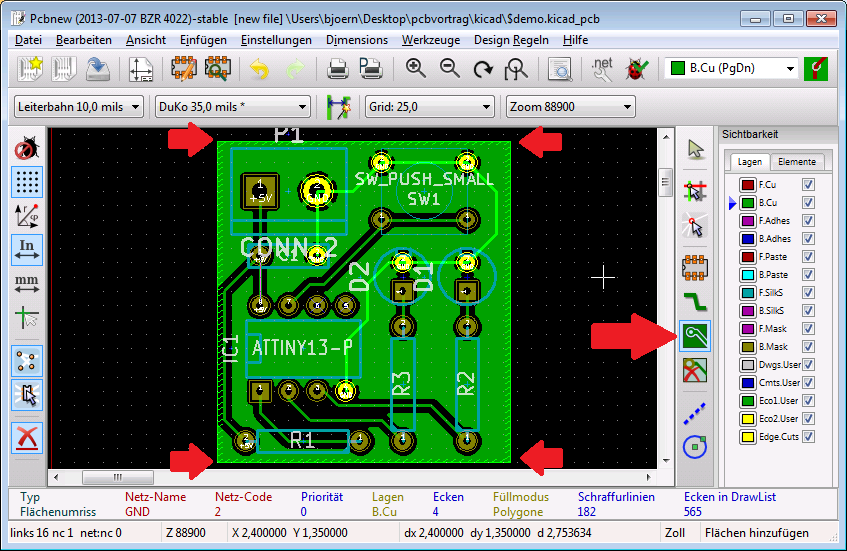
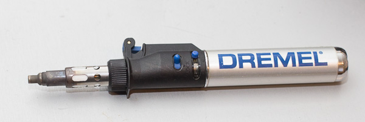

# Ätzt richtig 				
**Von der Idee zum Säurebad**

<table class="credits">
<tr><td>Autor:</td><td>Björn Weis</td></tr>
<tr><td>Version:</td><td>0.5 (03.03.2016)</td></tr>
<tr><td>Lizenz:</td><td></td></tr>
</table>
 
Changelog:
<ul style="margin: 0;">
	<li>20.08.2014 - (Björn) - Erste Version</li>
	<li>03.09.2014 - (Björn) - SMD-Teile hinzugefügt</li>
	<li>02.03.2016 - (Anna)  - Lektorieren</li>
	<li>03.03.2016 - (Björn) - Bilder hinzufügen</li>
</ul>

---

# Vorwort
In dieser Präsentation verwende ich eindeutige Produktbezeichnungen und Links zu Herstellern.

Alle hier vorgestellten Produkte haben den Status "funktioniert so für mich". 

Es kann sehr frustrierend enden, wenn bestimmte Parameter geändert werden - z.B. die Stärke der UV-Lampen. Um ein möglichst reproduzierbares Ergebnis zu erhalten empfehle ich einige Produkte. 

Ich möchte für nichts werben - alles kann durch Anpassung der Rahmenbedingungen irgendwie ersetzt werden.

---

# Agenda

1. [Erste Gedanken](#concept)
	1. Größe der Platine
	2. SMD oder lieber doch nicht?
	3. Single- oder Dual-Layer?
2. [Was wird benötigt](#whatyouneed)
	1. Haushaltsmaterialien
	2. Spezialkram
	3. Projektbezogenes
3. [KiCAD](#kicad)
	1. Download + Firstrun   
	2. Einen Schaltplan erstellen
	3. Externe Bibliotheken einbinden
	4. Footprints zuweisen
	5. Board-Layout erstellen
	6. Freerouter
4. [Drucken](#print)
	1. Methoden
		1. Tonertransfer
		2. Folie und Tintenstrahl
5. [Kleben](#stick)
	1. Single-Layer
	2. Dual-Layer

---
 
6. [Belichten](#exposure)
	1. Geräte
	2. Der richtige Zeitpunkt
	3. Doppelseitig
7. [Ätzen](#etching)
	1. Sicherheit
	2. Vorbereitungen
	3. Erster Lauf mit Natriumhydroxid
 	4. Reparaturen
 	5. Natriumpersulfat vs. Eisen III Chlorid
 	6. Zweiter Lauf mit Natriumpersulfat
 	7. Zweiter Lauf mit Eisen III Chlorid
 	8. Reinigen
	9. Entsorgung
8. [Nachbereitung](#postprocessing)
	1. Versiegeln
	2. Bohren
	3. Bestücken
	4. Extra: SMD-Löten	
	
---

# Erste Gedanken 	{#concept}
- Schnell / Ordentlich?
- Spielt die Größe eine Rolle?
- Muss ich mich an ein Gehäuse halten? (z.B. Hutschiene)

---

# Was wird benötigt	{#whatyouneed}
Diese Dinge dürfen auf keinen Fall fehlen.

## Haushaltsmaterialien
- Klebestift
- Große Schere
- Pappkarton
- Eieruhr
- Alte Klamotten
- Küchenrolle (reichlich)
- Feiner Permanent-Marker
- Cuttermesser
- Große Mülltüten
- 2 oder 3 Plastikbehälter (mind. so groß wie die Platine)
- Strohhälme
- Spiritus

---

## Spezialkram
- Dünne Gummihandschuhe
- Tinte-Transfer-Folie (reichlich)
- Gesichtsbräuner
- UV-Schutzbrille
- Zwei schwere Glasplatten
- Kleine Glasscheibe / Plexiglas `(Dual-Layer)`
- Doppelseitiges Klebeband / Teppichklebeband `(Dual-Layer)`
- Schutzbrille
- Thermometer
- Holzzwinge `(Optional)`
- Natriumhydroxid [^1]
- Natriumpersulfat [^2] oder Eisen III Chlorid [^3]
- Standbohrmaschine / Dremel-Workbench
- Bohrerset - 0.3mm bis 1.2mm
- Zwei Kanister + Beschriftung und Warnsymbolen

[^1]: https://de.wikipedia.org/wiki/Natriumhydroxid
[^2]: https://de.wikipedia.org/wiki/Natriumpersulfat
[^3]: https://de.wikipedia.org/wiki/Eisen%28III%29-chlorid

## Projektbezogen
- Foto-Positiv Platine `Auf dunkle Lagerung achten!`
- Lötlack z.B. `Lötlack SK 10`

---

# KiCAD				{#kicad}

## Download + Firstrun   
Download unter [http://kicad-pcb.org/download/]()

- Neues Projekt anlegen
- Sofort in einem Projektordner speichern

---

## EESchema starten
Legt einen neuen Schaltplan an

---

## Einen Schaltplan erstellen
ggf. eine Meldung, dass die Datei (noch nicht) existiert wegklicken.

---

## Erste Bauteile hinzufügen
### Shortcuts
- `STRG + P` Stromquelle / Masse hinzufügen
- `STRG + A` Bauteil hinzufügen

---

## Weitere Bauteile hinzufügen
### Standardkomponenten
- `R`       Widerstand
- `C | CP1` Kondensator | Elko
- `LED`     LED
- `CONN_X`  Pins mit Anzahl X
  

---

## Werte ändern
- `Mouseover + V` Wert editieren (z.B. 10KOhm)
- `Mouseover + E` Bauteil editieren

---

## Verbindungen zuweisen
- Mit der Maus "hin wandern"
- `W` drücken
- Am Ende wieder `W` drücken, oder Doppelklicken

---

## Nicht verwendete Pins markieren
- `Shift + Q` drücken
- Pin anklicken
- Werkzeug mit `ESC` schließen (gilt für alle Werkzeuge)
- Wird für den `Electrical Rules Check - kurz ERC` benötigt

---

## Annotationen im Schaltplan durchführen
- Weist den Bauteilen einen eindeutigen Namen zu
- Kann auch von Hand erledigt werden (nervig)
- Wird für alle weiteren Schritte **unbedingt** benötigt
- Bestehende Annotationen werden nicht geändert

---
## Electrical Rules Check (ERC) durchführen
- Findet schnell einige Fehler
- Ist nicht zu 100% zuverlässig
	- `PWR_FLAG` fehlt
	- Lib's sind nicht zu 100% kompatibel

---

## Netzliste erstellen
- Nach jeder Änderung notwendig
	- (sollte bereits aktiv PCBNew benutz werden)

---

## CvPCB starten

---

## Externe Bibliotheken einbinden
Download unter [http://www.kicadlib.org/]()

---

## Footprints zuweisen

---
## Standard Footprints ausdrucken
- Hilfreich zum "Nachmessen"

---

## Board-Layout erstellen
### PCBnew starten

---

## Netzliste einlesen
- Bei jeder Änderung im Schaltplan notwendig

---

## Netzliste einlesen

---

## Alle Bauteile verschieben
- Beseitigt das Chaos beim ersten Einlesen

---

## Bauteile ausrichten
- Taste `M` zum Verschieben

---

## Routen
- Taste `X` zum Verlegen
- Nicht 90° geknickt
	- (Reflexionen bei zu hohen Geschwindigkeiten)
	- (Kupferbahn kann sich leichter lösen)

---

### Leiterbahnwerte
* Leiterbahnbreite: mind. 0.25mm
* Leiterbahnabstand: mind. 0.25mm 

---

## Freerouter
* Download unter [https://github.com/nikropht/FreeRouting]()
* Sehr kompliziert zu kompilieren. (Verwendet Java + Netbeans)

---

## GND mit Fläche füllen
- Fächenwerkzeug auswählen
- Netz auswählen - hier `GND`
- Fläche mit klicken definieren

---

# Drucken			{#print}
* Platine in PCBNew duplizieren (A4 ausfüllen)
* Auf Tintenstrahl
* Feinste Einstellung
* Zwei Versionen (normal & gespiegelt - für's Kleben)
* Funktioniert ganz gut mit:
	* `Brunnen` Inkjet Folie (teuer & präzise)
	* `LO-A4-T149-100A` tut's auch (sehr günstig - braucht mehrere Lagen)

---

# Kleben			{#stick}
- Layout großzügig ausschneiden (min. 5cm Rand)
- Mind. 3 Lagen (je nach Folie)
- Mit Klebestift auf den Umrissen entlang fahren
- Funktioniert am Besten auf einem Glastisch mit Licht von unten
- Liegen die Lagen **richtig herum**?

## Single-Layer
- Abstandsmarker aufkleben

## Dual-Layer
- Ein Stück Abfallplatine abschneiden
- An die Ränder kleben, damit eine Tasche entsteht
- Glas / Plexiglasscheibe als Abstandshalter verwenden
- Genau ausrichten und gut fixieren

---

# Belichten			{#exposure}

- Gesichtsbräuner mit 4x 18 Watt UV Lampen reicht.
	- `z.B. Efbe-Schott GB 834`
- Geht einfacher mit einer Zeitschaltuhr / Funksteckdosen

---

## Schritte
1.	Eieruhr bereit legen
2.	Gesichtsbräuner gerade hinlegen
3.	Glasplatte #1 "aufbocken" - Abstand zu den Röhren: 25cm
4.	Platine mit Folie auflegen
5.	Glasplatte **gerade** oben drauf legen
6.	Belichter und Uhr anwerfen. (Grober Richtwert bei 20°C: ~3:40min)

---

# Ätzen				{#etching}

## Sicherheit
- **Handschuhe** & **Schutzbrille** tragen
- Arbeitsfläche großzügig mit einem Müllbeutel abkleben
- Für ausreichend **Belüftung** sorgen (mehr als Fenster auf kipp)
- Schuhe / Hauspuschen statt Barfuß / auf Socken

---

## Vorbereitungen
- Flächen abkleben
- Behälter aufstellen
- Spiritus, Permanent-Marker, Cutter, Küchenrolle bereitstellen
- Wasserkocher anschmeißen

---

## Erster Lauf mit Natriumhydroxid
- Stark konzentrierte Natronlauge
- Ideale Temperatur zwischen 20 bis 25°C `(Zimmertemperatur)`
- 10g Entwickler `(leicht gehäufter Teelöffel)` auf 500ml Wasser
- Viel hilft viel `(etwas mehr schadet nicht / beschleunigt)`
	- viel zu viel löst dann doch alles auf
- Behälter gut verschließen `(zieht Feuchtigkeit)`
- Natriumsilikat `Na2SiO3` wäre eine Alternative
- Platine immer in Bewegung halten. (**Handschuhe**)
- Mit dem Finger leicht über die Bahnen streichen
- Wenn alle Schlieren weg sind - **Sofort** mit Wasser abspülen

---

## Reparaturen
- Leiterbahnen prüfen
- Sind Risse in einigen Leiterbahnen zu sehen -> mit Permanent-Marker nachziehen
	- Hier haben sich die `Lumocolor(c) Permanent` Marker von `Staedtler(R)` gegen das Natriumpersulfat gut bewährt. 
- Sind Strukturen nicht klar voneinander abgetrennt -> Mit Cutter und Lineal sanft "drüberfahren" und nochmal kurz ins Bad werfen.

---

## Natriumpersulfat vs. Eisen III Chlorid

### Natriumpersulfat
<pre>
	+ Feine Strukturen gelingen fast immer
	- Muss permanent auf ~50°C gehalten werden ???
	- Teuer
	- Schnell gesättigt
	- Wenig ergiebig
	- Sehr langsam
</pre>

### Eisen III Chlorid
<pre>
	+ Etwas günstiger
	+ Prozess läuft sehr schnell
	+ Sehr ergiebig
	o Extrem feine Strukturen leiden
	- Prozess lässt sich schwer beobachten
	- Zieht Feuchtigkeit
	- Schlecht länger lagerbar 
	- Wahnsinnige Sauerei
	- Flecken zerstören Kleidung
	- Flecken für die Ewigkeit (z.B. an Fliesen)
</pre>

---

## Zweiter Lauf mit Natriumpersulfat
- Ideale Temperatur zwischen 40 und 50°C
- 100 bis 125g Ätznatron auf 500ml Wasser
- Platine muss in Bewegung bleiben und Sauerstoff bekommen
	- von Hand mit **Handschuh** schwenken / an die Luft holen
	- Holzzwinge benutzen
	- mit einem langen Strohhalm Luft unter die Kupferfläche blasen
- Temperatur im Bad sollte konstant gehalten werden
	- (ggf. Bad im Bad) 

---

## Zweiter Lauf mit Eisen III Chlorid
- Ideale Temperatur zwischen 30 und 40°C
- 400g auf 500ml Wasser
- Bad muss im Bewegung bleiben
	- von Hand mit **Handschuh**
	- Holzzwinge verwenden
- Temperatur im Bad sollte konstant gehalten werden
	- (ggf. Bad im Bad)

---

## Reinigen
- Mit klarem Wasser abspülen
- Etwas Spiritus auf die Küchenrolle geben
- Platine mit leichtem Druck abputzen, bis der restliche Fotolack abgeht

---

## Entsorgung
- Unter gar **keinen** Umständen die benutzten Chemikalien in den Abfluss oder die Toilette kippen.
- Alle benutzen Chemikalien in den Kanistern entsorgen.
	- **keine** Lebensmittelbehälter verwenden - z.B. PET-Flaschen, Tupperware, etc...
- Kleines **Luftloch** im Kanister mit Natriumpersulfatlösung
	- Gase entwickeln sich
	- Kanister könnte unter hohem Druck stehen und bersten
- Die Kanister (wenn sie langsam voll werden) gegen eine geringe Gebühr beim **Wertstoffhof** leeren lassen. 

---

# Nachbereitung		{#postprocessing}

## Versiegeln
- Mit `Lötlack SK 10` leicht benetzen. (**Draußen!**)
- Viertelstunde trocknen lassen.
- Kupfer läuft nicht an
- Einfacher zu löten

---

## Bohren

### Größen
- Widerstände, etc.: 0.7mm
- Buttons, Buzzer, etc.: 0.8mm - 0.9mm

### Werkzeug
Im Privatbereich (Preis/Leistung):

- `Dremel(R) 200 Series 200-5` mit Spiralbohrerkassette `EAN:2615062832`
- `Dremel(R) WorkStation(TM) 220-01` (Erspart wesentlich viel Arbeit)

Ansonsten eigenet sich auch jede Standbohrmaschine oder CNC-Fräse.

---

## Dremel Workbench

---

## Bestücken & sichern

---

## Bestücken & sichern
- Mit `Schutzlack 70` leicht benetzen. (Optional / **Draußen!**)
- Viertelstunde trocknen lassen.
- Hoch isolierend

---

## Extra: SMD-Löten	

- `Dremel(R) Versatip(TM)` zum "festbraten"
- `CR 88 SMD Lötpaste` - Perfekt zum SMD löten (nicht allzu lange lagerbar!)
- Platine leicht "vorheizen" - Lötpaste verläuft dann besser

---

# Vielen Dank für die Aufmerksamkeit

# Präsentation unter [http://bweis.de/vortrag/pcb]

